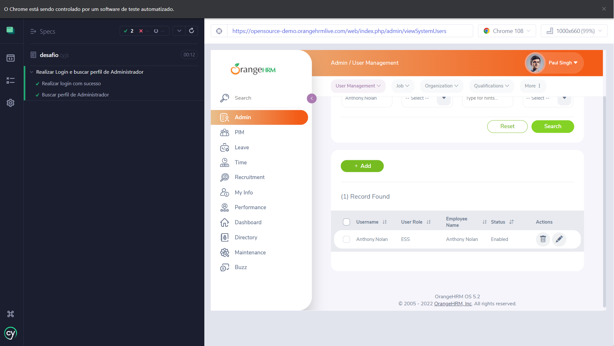

<h1 align="center"> Desafio Minsait </h1>

Resposta ao desafio proposto em sala de aula para a conclusão da Formação em Testes Manuais e Automatizados - Minsait utilizando a ferramenta Cypress.


<p align="center">
  <a href="#-tecnologias">🚀 Tecnologias</a>&nbsp;&nbsp;&nbsp;|&nbsp;&nbsp;&nbsp;
  <a href="#-desafio">💻 Desafio</a>&nbsp;&nbsp;&nbsp;|&nbsp;&nbsp;&nbsp;
  <a href="#-instalação">🔖 Instalação</a>&nbsp;&nbsp;&nbsp;|&nbsp;&nbsp;&nbsp;
  <a href="#memo-licença">:memo: Licença</a>
</p>

<br>

<p align="center">
  
</p>


## 🚀 Tecnologias

Esse projeto foi desenvolvido com a seguinte tecnologia:


<br>

## 💻 Desafio

Dado o site: https://opensource-demo.orangehrmlive.com/

Realize a criação de um **novo projeto** com o framework Cypress com as seguintes condições: 

<ol>
  <li>Crie no minimo 2 e no máximo 3 suites de testes (Arquivos de testes)</li>
    
  <li>Crie para cada suite de teste no mínimo 2 e no máximo 4 Casos de Teste</li>
</ol>

Serão avaliados:

<ol>
  <li>Boas práticas de configuração do projeto</li>
    
  <li>Estrutura dos testes bem como seus fluxos</li>
    
  <li>Boas práticas na utilização de comandos e seletores Cypress</li>
    
  <li>Simplicidade e independência dos casos de teste</li>
    
  <li>Validações nos fluxos dos testes</li>
</ol>

Forma da entrega

<ol>
  <li>Será criado no Google Class uma atividade para envio/upload do projeto em formato .zip.</li>
  <li>O aluno também pode postar o endereço do projeto em um repositório online (não esquecer de deixar público)</li>
</ol>

Retorno

<ul>O retorno será feito na própria atividade no Google Class.</ul>

## 🔖 Instalação

Cypress requer [Node.js](https://nodejs.org/) 

Após instalação do Node, instale as dependências:

```sh
npm install cypress --save-dev
```

Depois abra o cypress:

```sh
npx cypress open
```
<br>

## :memo: Licença

Esse projeto está sob a licença MIT.

---

Desenvolvido por [Thiago Honorato](https://www.linkedin.com/in/honoratothiago/)


 

